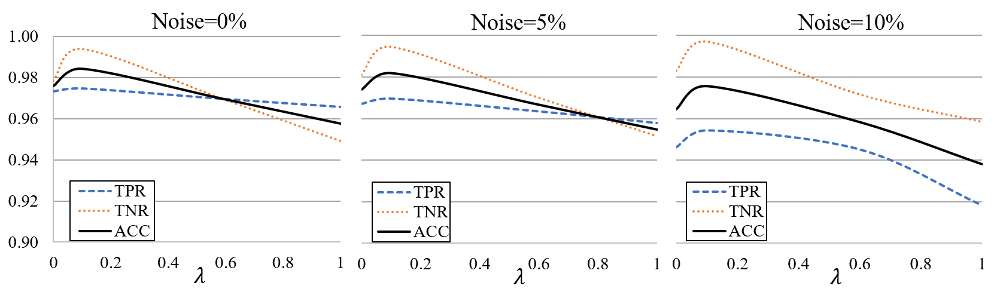
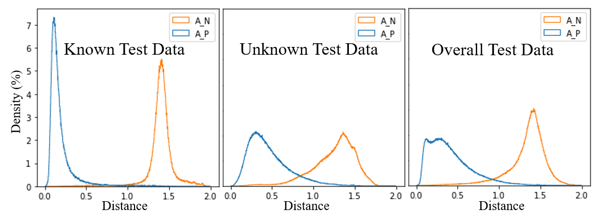
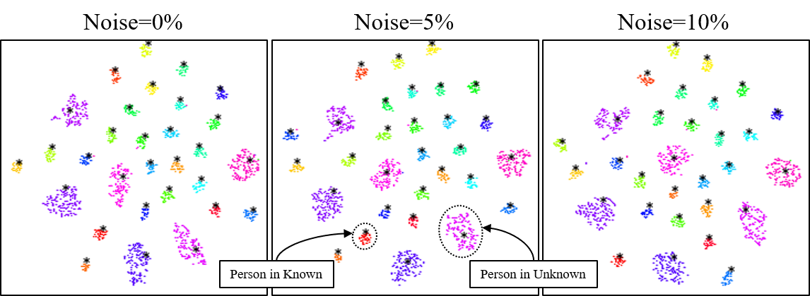

# Prototyping-Encoder-Decoder-with-Triplet-Loss
This repository is the official implementation of Prototyping Encoder-Decoder with Triplet Loss: Multimodal Few-Shot Learning for Gait Recognition
# Requirements
To install requirements:
```
pip install -r requirements.txt
```
# Training
To train the models() in the paper, run this command:
```
cd code
python training.py
```
We repeat our experiment 20 times. Each time, we select 80% of 30 participants randomly. For each participant in selected 24 people, 75% of unit steps are allocated to the training set and the rest is assigned to the known test data set. In addition, for the remaning 20% of 30 participants(6 people), all unit steps belong to unknown test data set. <br/><br/>
For each repetition, our proposed method is trained and tested independently, then the averaged evaluation metrics are summarized.

# Evaluation
We divide our test set into known and unknown data sets. We define a unit step in the known test data set as true positive (TP) if it is recognized correctly, and false negative (FN) otherwise. Also, we define a unit step in the unknown data set as true negative (TN) if it is not recognized as any known participant, and false positive (FP) otherwise. 
<br/>
We report true postive rate , true negative rate , and accuracy 


# Pre-trained Model
You can download pretrained model here: [Pretrained model](https://drive.google.com/file/d/1Rrrc_qbS7MHi9rIxmBGU38nNxuq6AM_y/view?usp=sharing)


# Results
Our model performance:
| Noise rate |     0%    |   5%   |   10%   | 
|------------|-----------|--------|---------|
|Performance | TPR TNR ACC| TPR TNR ACC  | TPR TNR ACC|
|lambda = 0  |            |              |            |
|lambda = 0.1|            |              |            |
|lambda = 1.0|            |              |            |

Performance as function of lambda:

Distance Distribution:

T-sne:


# Contributing
